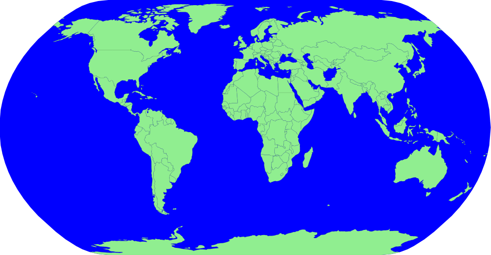

# :earth_americas: World Map with D3

Basic concepts about making a world map with D3.js.

## :mag: Screenshot

  

## 🛠 Build with
- [d3.js](https://d3js.org/)
- [topoJson](https://github.com/topojson/topojson)
- [npm world-atlas](https://www.npmjs.com/package/world-atlas)

Classroom with [Curran Kelleher](https://www.youtube.com/user/currankelleher/videos). Thanks so much!

